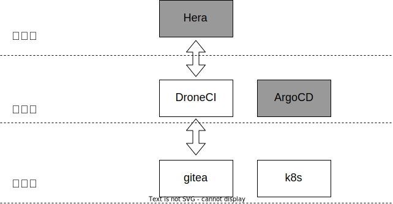

# 发布系统

> CI&CD

|系统名称|介绍|
|---|---|
|Hera|希腊女神赫拉，这里代指CI/CD系统的名称。用于管理应用的元信息以及构建和部署信息及其过程。
|DroneCI| 开源CI系统，用于构建和部署应用
|ArgoCD|开源CD系统，用于部署应用（未实现）
|K8s|由谷歌开源的知名云原生平台，用于调度服务器资源。不同环境可以配置不同的k8s集群。

## 流程介绍

### 名词解释

|名词|解释|
|---|---|
|FAT|功能验收测试环境，日常开发测试的主力环境
|UAT|用户验收测试环境
|PRE| 预发布环境,上线前验收环境
|PRO|生产环境
|集成列表|当前环境的工作区（git分支）。
|待集成列表|不直接从git仓库同步分支，而是采用登记的方式获得,详细说明见附录）

### FAT阶段说明：

1. 研发a开发自测完成后发布到FAT环境然后提测
2. 研发b开发自测完成后发布到FAT环境然后提测
3. 研发c这个时候已经发布了分支f，系统可以检测当前分支落后了，要求研发必须合并线上代码，才能发布到FAT环境。

在通过待集成列表公示当前工作区有那么不稳定的构建，并且如果有重复的工作也可以提前沟通，减少冲突。

### PRE阶段说明：

研发a的分支测试通过后，就可以集成到PRE环境了。此时b的分支未测试通过，将不影响a的分支的发布

和FAT分支一样PRE环境可以集成分支，但是PRE只能集成FAT环境待集成列表中的分支以及hostfix分支（紧急上线流程），并且集成可以通过审批流管控。

一般还可以在PRE设置测试覆盖率，依赖管理等卡点，确保上线的软件质量符合要求。

### PRO阶段说明：

PRO的构件必须是PRE环境构建好的（特性冻结），需要审批之后才能发布。建议做发布暂停功能，并且配合监控系统，及时止血。

## 附录

* [DroneCI API文档](https://docs.drone.io/api/overview/)